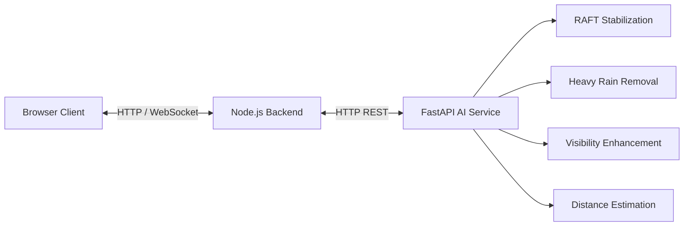

# VideoAI Platform

An enterprise-ready, fully automated AI-powered video processing platform. It processes video streams through modular AI pipelines, including Video Stabilization, Heavy Rain Removal, Video Visibility Enhancement, and Distance Estimation. Built with React + Vite on the frontend and Node.js + Express on the backend, with a Python FastAPI AI inference engine.

---

## 🌟 Project Overview

VideoAI Platform is designed to apply state-of-the-art computer vision models to recorded video files automatically. The platform features an easy-to-use web interface, real-time progress updates via WebSockets, and a modular AI service that leverages highly optimized lazy loading for dynamic CPU/GPU inference.

---

## 🏛 Architecture Diagram



---

## 📂 Folder Structure

```
video-ai-platform/
├── frontend/               # React + Vite + TailwindCSS
├── backend/                # Node.js + Express + Socket.io
├── ai-services/            # Python FastAPI AI models
│   ├── app/                # Application logic (lazy pipeline, routes, models)
│   ├── pretrained/         # Automatically downloaded checkpoints
│   ├── RAFT/               # Automatically cloned RAFT repo
│   ├── HeavyRainRemoval/   # Automatically cloned Rain repo
│   └── PromptIR/           # Automatically cloned PromptIR repo
├── distanceEstimation_d2/  # Distance Estimation Checkpoints & Config
├── scripts/                # Automation and deployment scripts
│   ├── setup.sh            # Main installation script
│   ├── setup_models.sh     # Model downloader
│   ├── start_all.sh        # Service launcher
│   ├── stop_all.sh         # Service stopper
│   ├── health_check.sh     # System health monitor
│   ├── verify_installation.py # Install verification tool
│   ├── verify_startup.sh   # Runtime verification tool
│   └── cleanup_legacy.py   # Final purge for legacy resources
└── logs/                   # System and application logs
```

---

## ⚙️ Technology Stack & Requirements

- **Frontend:** React 18, Vite, TailwindCSS
- **Backend:** Node.js 18.x, Express, Socket.io, yt-dlp
- **AI Core:** Python 3.10+, FastAPI, PyTorch, TorchVision
- **OS:** Linux / macOS (Optimized for Lightning AI and cloud VMs)
- **Dependencies:** **npm >= 9.x**, **git**, **curl**, **ffmpeg** (for browser playback)
- *Optional but recommended*: NVIDIA GPU with CUDA for faster inference.

---

## 🧠 Supported AI Models

1. **Video Stabilization (RAFT):** Optical flow model that removes camera shake and unwanted motion.
2. **Heavy Rain Removal:** Deep neural network designed to remove rain streaks from video frames.
3. **Video Visibility Enhancement (PromptIR):** Restores degraded frames and enhances contrast and sharpness.
4. **Distance Estimation:** Custom FasterRCNN model that detects objects and estimates their distance in meters natively overlaid on the output frames.

---

## 🚀 Installation

The repository is completely self-installing. It will automatically download all dependencies, create virtual environments, clone AI repositories, and fetch all necessary weights.

```bash
git clone <your-repository-url> video-ai-platform
cd video-ai-platform

# Run the automated setup
bash scripts/setup.sh

# (Optional) Run legacy cleanup
python3 scripts/cleanup_legacy.py
```

---

## ⚡ Running Locally

Start all services (Frontend, Backend, and AI Service):

```bash
bash scripts/start_all.sh
```

- **Frontend:** http://localhost:5173
- **Backend:** http://localhost:5000
- **AI API Docs:** http://localhost:8000/docs

### 🏥 Health Checks & Stopping

To verify the health of all running services (Node, React, Python):

```bash
bash scripts/health_check.sh
```

To gracefully stop all services:

```bash
bash scripts/stop_all.sh
```

---

## 🌐 Frontend Usage

1. **Uploading Videos:** Drag and drop any `.mp4`, `.avi`, `.mov`, `.mkv`, or `.webm` file into the upload zone.
2. **Using Video URLs:** Switch to the "Video URL" tab. Paste links from YouTube, Vimeo, Google Drive, or direct MP4 links.
3. **Pipeline Selection:** Click on the toggles for any combination of `Distance Estimation`, `Heavy Rain Removal`, `Video Stabilization`, or `Visibility Enhancement`.
4. **Processing & Output:** Click `Process Video`. The frontend will stream live progress and logs. When complete, the processed video will appear in the Output panel for browser previewing or downloading.

---

## 🛠 Configuration (Environment Variables)

Configuration is managed via `.env` files generated automatically by `setup.sh`. 

**`ai-services/.env`**
- `DEVICE=auto|cuda|cpu`: Force GPU or CPU inference.
- `FRAME_BUFFER_SIZE`: Manage memory threshold limits for RAFT.
- `DISTANCE_WEIGHTS_PATH` / `DISTANCE_YAML_PATH`: Pointers to the custom FasterRCNN model.

**`backend/.env`**
- `PORT`: Backend server port (default 5000).
- `AI_SERVICE_URL`: Route to the FastAPI inference engine.

---

## 🔌 API Endpoints

### `POST /api/process`
Starts a new video processing job asynchronously.

**Request payload:**
```json
{
  "videoUrl": "https://example.com/video.mp4",
  "stabilization": true,
  "heavyRainRemoval": true,
  "videoVisibility": false,
  "distanceEstimation": true
}
```
**Response:** `202 Accepted` (Includes `jobId`)

### `GET /api/status/:jobId`
Poll job processing status.

### `GET /api/result/:jobId`
Returns the final output URL for streaming/downloading.

---

## 📉 Performance Notes & Workflows

The AI pipeline incorporates strict **Lazy Loading**. When you submit a video, only the requested AI models are loaded into VRAM. Immediately after the final frame is written, the models are safely purged and CUDA cache is emptied. This design ensures that you can safely run memory-intensive operations (like PromptIR) in isolation without encountering OOM crashes from inactive models natively loaded in memory.

---

## ⚠️ Troubleshooting Guide & Common Errors

- **AI Service Fails to Start:** Check `logs/ai.log`. Ensure Python 3.10+ is installed.
- **CUDA Out of Memory:** Ensure `DEVICE=auto`. If you are running multiple features simultaneously, you may need to rely on CPU fallback. 
- **Model Downloads Failing:** Ensure you have an active internet connection. `setup_models.sh` supports auto-retries via `curl`.
- **Browser Playback Failed:** Ensure `ffmpeg` is globally installed. The AI platform automatically remuxes AVI/MKV outputs to browser-compliant H.264 MP4s.

---

## 📜 License
This project is licensed under the MIT License.
