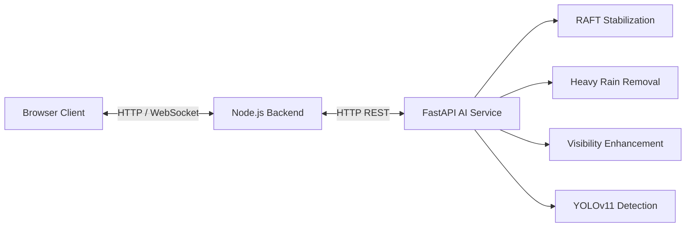

# VideoAI Platform

An enterprise-ready, fully automated AI-powered video processing platform. It processes video streams through modular AI pipelines, including Video Stabilization, Heavy Rain Removal, Video Visibility Enhancement, and Object Detection. Built with React + Vite on the frontend and Node.js + Express on the backend, with a Python FastAPI AI inference engine.

---

## 🌟 Project Overview

VideoAI Platform is designed to apply state-of-the-art computer vision models to recorded video files automatically. The platform features an easy-to-use web interface, real-time progress updates via WebSockets, and a modular AI service that can run on CPU or GPU.

---

## 🏛 Architecture Diagram



---

## 📂 Folder Structure

```
video-ai-platform/
├── frontend/               # React + Vite + TailwindCSS
├── backend/                # Node.js + Express + Socket.io
├── ai-services/            # Python FastAPI AI models
│   ├── app/                # Application logic (pipeline, routes, models)
│   ├── pretrained/         # Automatically downloaded checkpoints
│   ├── RAFT/               # Automatically cloned RAFT repo
│   ├── HeavyRainRemoval/   # Automatically cloned Rain repo
│   └── PromptIR/           # Automatically cloned PromptIR repo
├── scripts/                # Automation and deployment scripts
│   ├── setup.sh            # Main installation script
│   ├── setup_models.sh     # Model downloader
│   ├── start_all.sh        # Service launcher
│   ├── stop_all.sh         # Service stopper
│   ├── health_check.sh     # System health monitor
│   └── verify_installation.py # Install verification tool
└── logs/                   # System and application logs
```

---

## ⚙️ Requirements

- **Linux / macOS** (Compatible with Lightning AI and cloud VMs)
- **Python >= 3.10**
- **Node.js >= 18.x**
- **npm >= 9.x**
- **git**, **wget/curl**, and **ffmpeg** (required for browser video playback)
- *Optional but recommended*: NVIDIA GPU with CUDA for faster inference.

---

## 🚀 Installation

The repository is completely self-installing. It will automatically download all dependencies, create virtual environments, clone AI repositories, and fetch all necessary weights (approx. 600MB).

```bash
git clone <your-repository-url> video-ai-platform
cd video-ai-platform

# Run the automated setup
bash scripts/setup.sh
```

---

## ⚡ Quick Start

Start all services (Frontend, Backend, and AI Service):

```bash
bash scripts/start_all.sh
```

- **Frontend:** http://localhost:5173
- **Backend:** http://localhost:5000
- **AI API Docs:** http://localhost:8000/docs

To gracefully stop all services:

```bash
bash scripts/stop_all.sh
```

To verify the health of all running services:

```bash
bash scripts/health_check.sh
```

---

## 📸 Screenshots


*(Add screenshots of the web interface here)*

---

## ✨ Project Features

- **Automated Deployment:** Zero-configuration installation using `setup.sh`.
- **Idempotent Setup:** Safe to run setup multiple times; automatically skips existing files.
- **Real-Time Progress:** WebSocket-based progress bars and live logging.
- **Dynamic Pipeline:** Enable or disable AI features individually for each video.
- **Hardware Agnostic:** Automatically detects CUDA for GPU acceleration, gracefully falls back to CPU.

---

## 🧠 Supported AI Models

1. **Video Stabilization (RAFT):** Optical flow model that removes camera shake and unwanted motion.
2. **Heavy Rain Removal:** Deep neural network designed to remove rain streaks from video frames.
3. **Video Visibility Enhancement (PromptIR):** Restores degraded frames and enhances contrast and sharpness.
4. **Object Detection (YOLOv11):** Detects and tracks objects across frames, providing a final detection summary count.

---

## 🛠 Configuration

Configuration is managed via `.env` files. `setup.sh` generates these automatically from `.env.example` templates if they do not exist.

**`ai-services/.env`**
- Configures device (`DEVICE=auto|cuda|cpu`), ports, and AI model weight paths.
- Default confidence and IOU thresholds for YOLO are customizable here.

**`backend/.env`**
- Configures backend port and AI service URL routing.

---

## 🔌 API Documentation

### `POST /api/process`
Starts a new video processing job.

**Request:**
```json
{
  "videoUrl": "https://example.com/video.mp4",
  "stabilization": true,
  "heavyRainRemoval": true,
  "videoVisibility": false,
  "objectDetection": true
}
```
**Response:** `202 Accepted`

### `GET /api/status/:jobId`
Poll job processing status.

### `GET /api/result/:jobId`
Get the final result URL and detection summary of a completed job.

---

## ➕ How to Add New Models

1. **Define the Model:** Create a new Python class inheriting from `BaseModel` in `ai-services/app/models/`.
2. **Register in Pipeline:** Add it to the pipeline execution order in `PipelineManager` (`ai-services/app/pipeline/pipeline.py`).
3. **Update Schemas:** Extend the API request and response schemas in `ai-services/app/api/process.py`.
4. **Update Frontend UI:** Add a new toggle card in `FeaturePanel.jsx` and pass the new flag to `api.js`.
5. **Update Downloader:** Add the model's auto-download logic to `scripts/setup_models.sh`.

---

## ⚠️ Troubleshooting

- **AI Service Fails to Start:** Check `logs/ai.log`. Ensure Python 3.10+ is installed and the `venv` was created correctly.
- **Model Downloads Failing:** Ensure you have an active internet connection. `setup_models.sh` supports auto-retries via `wget` and `curl`.
- **GPU Not Detected:** Ensure CUDA drivers are installed and compatible with PyTorch. Check `scripts/health_check.sh` output for Compute Device status.

---

## 📜 License

This project is licensed under the MIT License.
